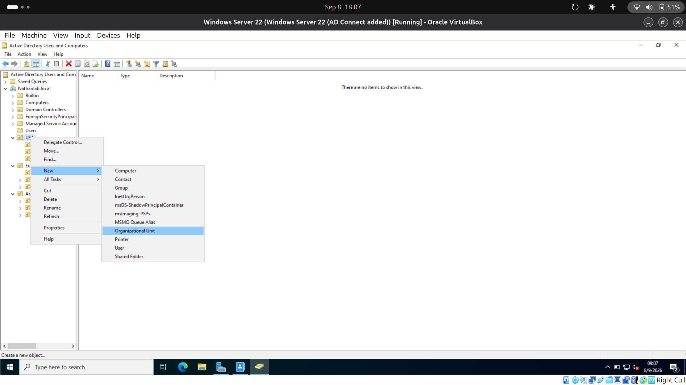
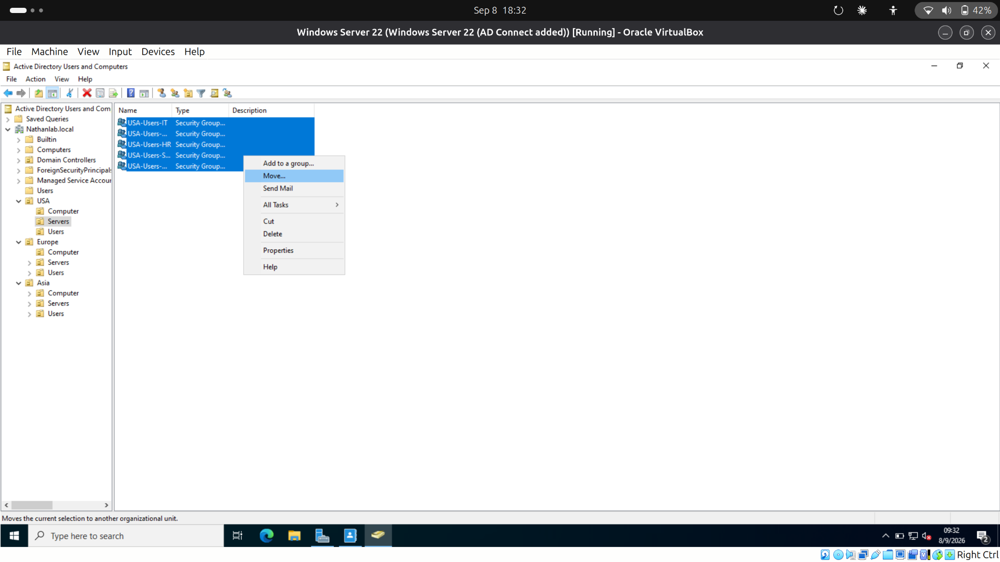
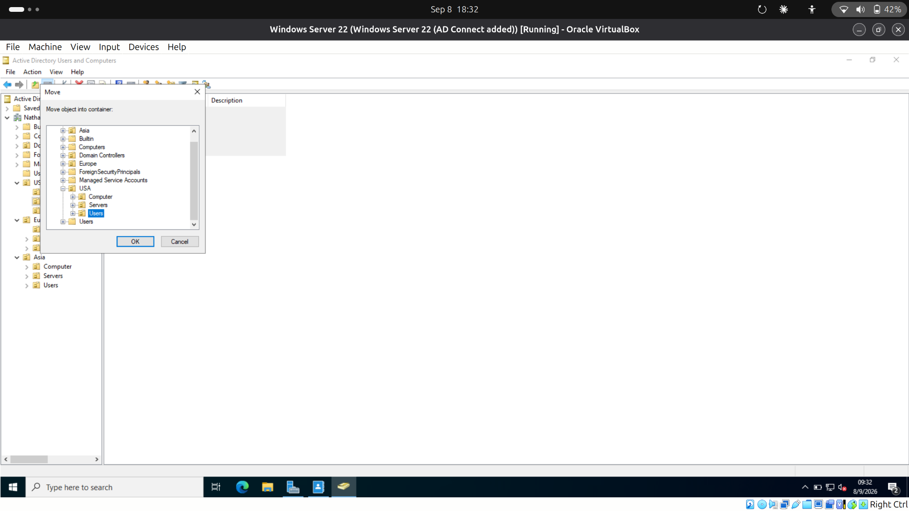
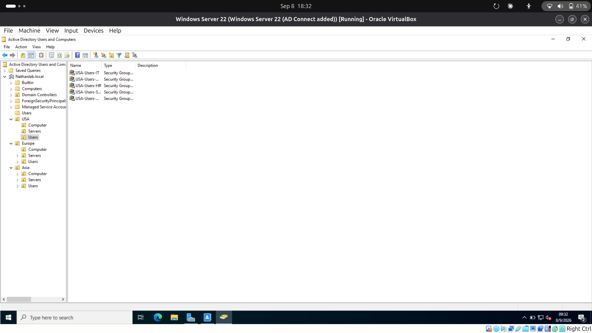

# Nathans-IT-Lab
Hands on IT/help desk lab work, AD, Azure, Ticketing practice
## Fixing Misplaced AD Groups

While setting up department-level Security groups (IT, Accounting, HR, Sales, Management) 
for the USA OU, I initially created them under the wrong container — Servers instead of 
Users. Rather than recreating the groups (not possible anyway, since AD group names must 
be unique domain-wide), I selected the affected groups in Active Directory Users and 
Computers and used the Move function to relocate them to the correct Users OU, preserving 
their names, settings, and time.

*Regional OU structure (USA, Europe, Asia) *

*Groups mistakenly created under the Servers OU instead of Users*

*Identifying the misplaced groups under Servers*

*Selecting the groups and using the Move function*

*Final result — groups correctly positioned under the Users OU*
